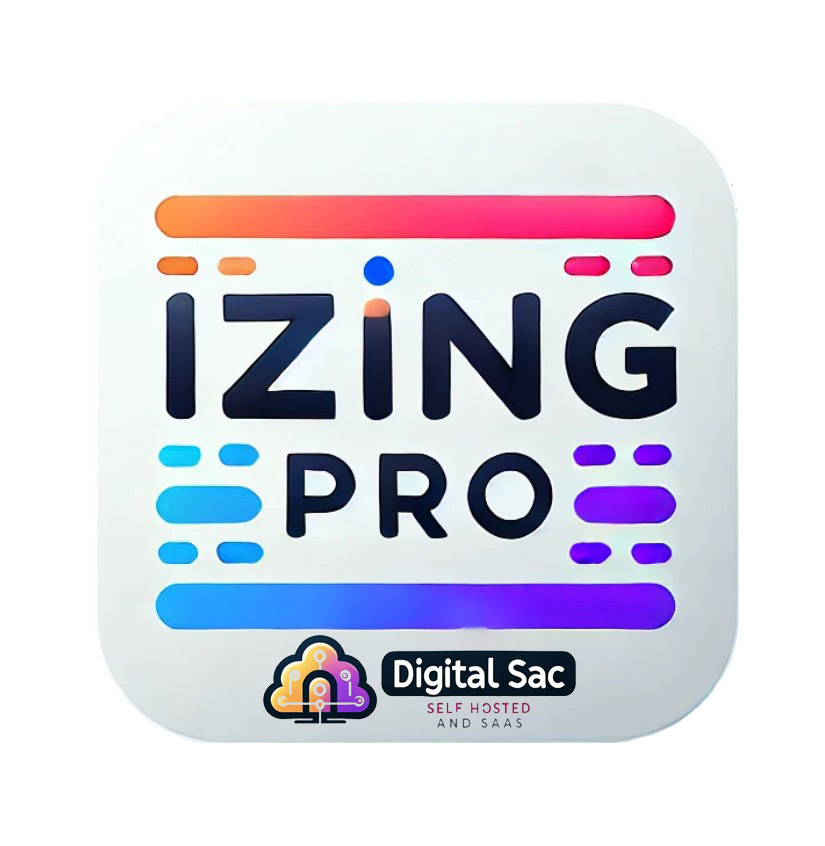
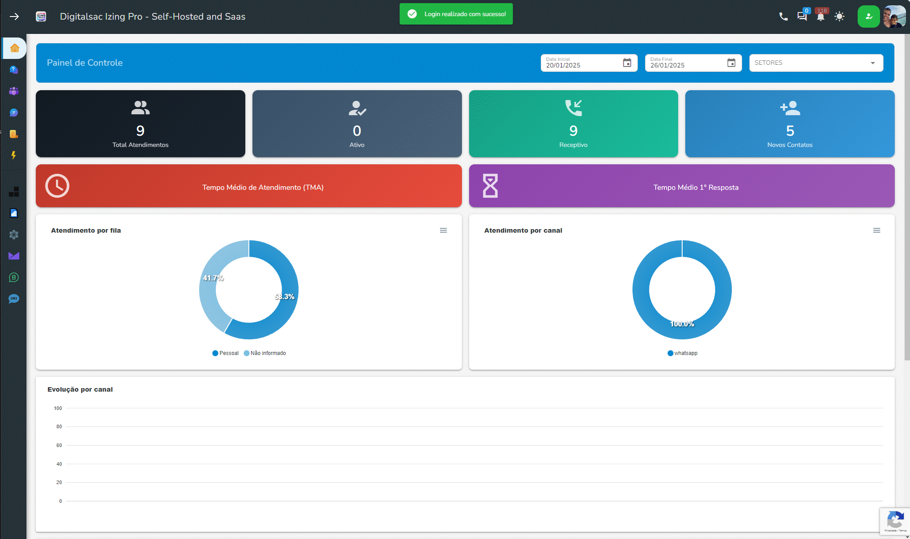
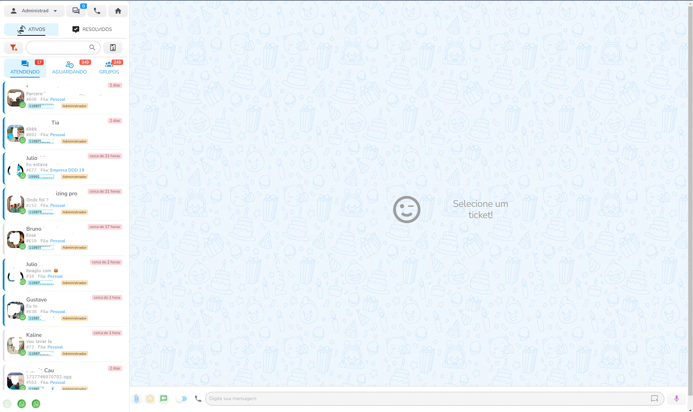
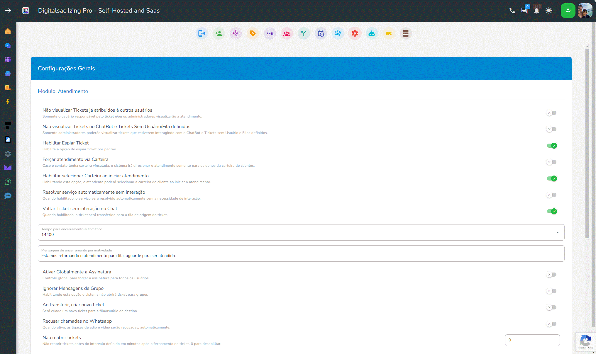

# Digitalsac Izing Pro Self Hosted ou Whitelabel

> 

Um sistema para gestão de atendimento multicanais centralizado.

Sistema possui o backend e canais baseado em:
- Whatsapp Baileys
- Telegram
- WABA oficial
- ConnectionHUB ( Instagram / Messenger )
- NotificameHUB ( Instagram / Messenger / Webchat / Email / Mercado livre )
- Wavoip

**IMPORTANTE**: não garantimos que a utilização desta ferramenta não irá gerar bloqueio nas contas utilizadas. São bots que em sua maioria utilizam APIs segundarias para comunicação com os fornecedores dos serviços. Use com responsabilidade!

## Screenshots
> 
___  
>
___
>
___
>
___
## Principais funcionalidades

- Multíplos canais de atendimento ✅
- Multíplos usuários simultâneos por canais de atendimento ✅
- Iniciar conversa com contatos existentes (whatsapp) ✅
- Construção de Chatbot interativo ✅
- Enviar e receber mensagens ✅
- Enviar e receber mídias diversas (imagens/áudio/documentos) ✅
- Multiempresas (abordagem de base compartilhada) ✅
- Módulo PerfexCRM gestao de Multiempresas ✅
- Módulo IA ✅
- Módulo Typebot ✅
- Módulo Campanhas ( Baileys / Waba e SMS ) ✅

Não vendemos códigos, sistema é whitelabel ou Self Hosted com planos mensal ou anual.

# Planos

| Funcionalidade                                  | Free |   Basic    |    Plus    |   Premium   |
|:------------------------------------------------|:----:|:----------:|:----------:|:-----------:|
| Instalação em Servidores                        |  1️⃣  |   5️⃣0️⃣*    |   5️⃣0️⃣*    |    5️⃣0️⃣*    |
| Tenants                                         |  1️⃣  |    ♾️     |     ♾️     |     ♾️     |
| Usuários                                        |  1️⃣  |    ♾️     |     ♾️     |     ♾️     |
| Acesso à API                                    |  ❌  |    ❌     |     ✅     |     ✅     |
| Conexões                                        |  1️⃣  |    ♾️     |     ♾️     |     ♾️     |
| Chatbots                                        |  1️⃣  |    ♾️     |     ♾️     |     ♾️     |
| Filas                                           |  1️⃣  |    ♾️     |     ♾️     |     ♾️     |
| Canal WaVoIP                                    |  ✅  |    ✅     |     ✅     |     ✅     |
| Canais NotificameHub                            |  ✅  |    ✅     |     ✅     |     ✅     |
| Conexão WABA                                    |  ❌  |    ❌     |     ✅     |     ✅     |
| Notas de Ticket                                 |  ❌  |    ❌     |     ✅     |     ✅     |
| Notas de Contatos                               |  ❌  |    ❌     |     ✅     |     ✅     |
| Painel Usuário NotificameHUB (2 Canais Inclusos)|  ❌  |    ✅     |     ✅     |     ❌     |
| Painel Revenda NotificameHub (2 Canais Inclusos)|  ❌  |    ❌     |     ❌     |     ✅     |
| Hospedagem PerfexCRM c/ Módulo Ger. DigitalSac  |  ❌  |    ✅     |     ✅     |     ✅     |
| Campanhas SMS                                   |  ❌  |    ❌     |     ❌     |     ✅     |
| Botões e Listas (Baileys)                       |  ✅  |    ✅     |     ✅     |     ✅     |
| Kanban                                          | ❌  |  ❌   |  ✅  |  ✅ |
| Canal Telegram                                  |  ✅  |    ✅     |     ✅     |     ✅     |
| Gerenciamento de Grupos Whatsapp                |  ✅  |    ✅     |     ✅     |     ✅     |
| Inteligência Artificial (Prompt IA para Chatbot)|  ❌  |    ❌     |     ❌     |     ✅     |
| Typebot                                         |  ❌  |    ❌     |     ✅     |     ✅     |
| Chat Interno                                    |  ❌  |    ❌     |     ✅     |     ✅     |
| Campanhas WABA                                  |  ❌  |    ❌     |     ❌     |     ✅     |
| Canais ConnectionHub                            |  ❌  |    ❌     |     ❌     |     ✅     |
| Custo Servidor Adicional / ano                  |  ❌  |  R$ 90,00  |  R$ 145,00 |   R$ 255,00   |
| Custo Painel PerfexCRM avulso / mês             |  ❌  |  R$ 100,00  |  R$ 100,00 |   R$ 100,00  |
| Canal Adicional NotificameHub / mês             |  ❌  |  R$ 45,00  |  R$ 45,00 |   R$ 30,00   |
| Canal Adicional ConnectionHub / mês             |  ❌  |  ❌  |  ❌ |   R$ 30,00  |
| Canal Adicional WaVoip / mês                   |  ❌  |  R$ 55,00  |  R$ 55,00 |   45,00   |
| Painel Revenda NotificameHub* c/ 10 canais Inclusos / mês  |  ❌  |  R$ 500,00  |  R$ 500,00 |   500,00   |
| *Canal Adicional NotificameHub Revenda / mês    |  ❌  |  R$ 30,00  |  R$ 30,00 |   30,00   |

*Contratação de 1 a 50 servidores consulte em nosso site: https://grupo.digitalsac.io

**TAXAS DE ATIVAÇÃO COBRADOS PELO NOTIFICAMEHUB**
- Whatsapp Oficial tem uma taxa de ativação de R$ 150,00
- Mercado livre, Youtube, OLX, Numero Virtual, Linkedin, Magalu - R$ 50,00 por canal

## Valores e Condições de Pagamento

### Plano Basic 50 Servidores ( Consulte para 1 Servidor )
- Valor Anual: R$ 2.988,00
- Parcelado em até 12x de R$ 249,00
- À vista com 20% de desconto: R$ 2.390,40

### Plano Plus 50 Servidores ( Consulte para 1 Servidor )
- Valor Anual: R$ 4.788,00
- Parcelado em até 12x de R$ 399,00
- À vista com 20% de desconto: R$ 3.830,40

### Plano Premium 50 Servidores ( Consulte para 1 Servidor )
- Valor Anual: R$ 8.388,00
- Parcelado em até 12x de R$ 699,00
- À vista com 20% de desconto: R$ 6.710,40

> **Observação**: Plano Free disponível gratuitamente para testes.

## Modelos de Cobrança por Tenant (Plano Premium)

🔹 **Opção 1: Com Valor Mensal Fixo**
- Assinatura fixa Perfex CRM + Painel Usuário NotificameHUB: R$ 99/mês
- Custo por tenant: R$ 45/mês
- Mínimo de 1 tenants, o cliente pode ter quantos quiser

#### Exemplos de Cobrança Mensal:

| Número de Tenants | Cálculo                  | Total Mensal |
|:------------------|:------------------------:|:------------:|
| 3 tenants         | R$ 99 + (2 × R$ 45)     | R$ 234       |
| 5 tenants         | R$ 99 + (5 × R$ 45)     | R$ 324       |
| 10 tenants        | R$ 99 + (10 × R$ 45)    | R$ 549       |
| 50 tenants        | R$ 99 + (50 × R$ 45)    | R$ 2.349     |

**Opcionais**
Servidor Adicional / mês - R$ 75,00
Canal Adicional NotificameHub / mês - R$ 55,00
Canal Adicional ConnectionHub / mês - R$ 55,00
Canal Adicional WaVoip / mês - R$ 55,00
Painel Revenda NotificameHub c/ 10 canais Inclusos / mês - R$ 500,00

🔹 **Vantagem**: Custo previsível, ideal para quem quer escalar aos poucos.

## Planos Whitelabel com Servidores no Brasil

Oferecemos planos Whitelabel completos com servidores hospedados no Brasil, sem custos adicionais de localização.

### Tabela de Planos

| Plano          | Conexões | Preço Mensal | Setup (único) |
|:--------------:|:--------:|:------------:|:-------------:|
| Starter        | 25       | R$ 749       | R$ 2.000      |
| Professional   | 50       | R$ 949       | R$ 2.000      |
| Business       | 100      | R$ 1.299     | R$ 2.000      |
| Enterprise     | 200      | R$ 2.499     | R$ 2.000      |

### Diferenciais Inclusos em Todos os Planos

✨ **Infraestrutura e Suporte**
- Servidores no Brasil sem custo adicional
- Setup reduzido: R$ 2.000 (taxa única)
- Suporte técnico 24 horas
- Atendentes ilimitados

🚀 **Funcionalidades Avançadas**
- Kanban (em desenvolvimento)
- Chatbot
- Agendamentos (em desenvolvimento)
- Respostas Rápidas
- Campanhas
- Integrações
- API & Webhooks

> **Observação**: Todos os planos incluem as funcionalidades avançadas sem custo adicional, garantindo uma experiência completa independente do plano escolhido.

# Licença

O Digitalsac Izing Pro é um software proprietário. Todos os direitos reservados.

Este software é distribuído sob um modelo de licenciamento comercial:
- Não é permitida a redistribuição do código fonte
- Não é permitida a modificação do código fonte sem autorização
- O uso do software está sujeito aos termos de serviço e condições estabelecidas pela Digitalsac
- As licenças são disponibilizadas em modelo whitelabel ou self-hosted com planos mensais ou anuais

Para mais informações sobre licenciamento e preços, entre em contato através dos canais oficiais:
- Site: https://grupo.digitalsac.io
- WhatsApp: https://wa.me/551931992370

# Comunidades
Whatsapp: https://chat.whatsapp.com/GM6jgbiCKi92xUJdFMZgyB
Telegram: https://t.me/digitalsac
